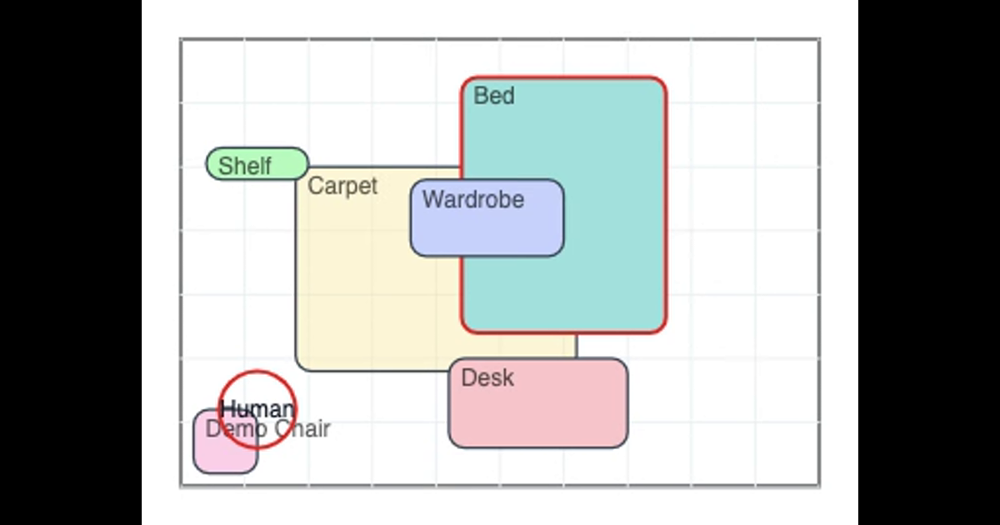

# p5 Room Planner — Bezalel M.Des D+T

An interactive, browser‑based 2D room planner built with p5.js and vanilla JavaScript. Designed as a course project for the M.Des Design & Technology program at Bezalel Academy, it focuses on tangible interaction patterns: snapping, constraints, spatial reasoning, and lightweight state management.

<!-- Prefer MP4 for smoother playback; fall back to GIF -->
<video src="docs/preview.mp4" autoplay loop muted playsinline width="800">
  Sorry, your browser doesn't support embedded videos. See the GIF below.
</video>


## Features

- Room sizing: set width/length (cm) and snap epsilon.
- Add items: name, color (palette or custom), W×L×H, flags: Hangable, Carpet.
- Drag and snap: edges snap to walls/neighbor items; carpets are “heightless”.
- Hangable stacking: shelves auto‑rest on the highest supporting surface underneath.
- Human probe: movable circle to quickly judge walkability/collisions.
- Rotate and clamp: 0°/90° with automatic in‑room clamping.
- Undo/redo: history stack with JSON snapshots.
- Import/export: save and load your scene as JSON.
- Zoom management: dynamic max zoom so the canvas fits the viewport; scroll fallback.
- Keyboard shortcuts: Delete, R to rotate, ⌘/Ctrl+Z undo, ⌘/Ctrl+Y redo.

## Getting Started

- Quick start (no server): open `index.html` in your browser.
- VS Code tasks (recommended):
  - Tasks → “Run UI tests” — serves locally and opens the test runner page.
  - Run and Debug → “Debug App (Chrome)” — serves and opens the app in Chrome.

Requirements: a modern browser. For VS Code tasks, Python 3 in PATH to run `python -m http.server`.

## Test Suite

An in‑browser runner drives the real UI and prints detailed logs.

- Open `tests/runner.html` (or use the “Open Test Runner in Chrome” debug config).
- The top bar shows totals; the log lists ✔/✘ with messages and stack traces.
- Buttons: Copy Logs, Download Logs, Download Scene JSON.

Covered behaviors include:

- Seeding sample items
- Edit selected item (W/L/H/Z/Rotation/Flags/Color)
- Add, duplicate, delete
- Undo/redo
- Room resize and zoom clamping
- Wall snap (button) and neighbor snap
- Rotation within bounds
- Human probe collisions
- Serialization round‑trip

## Code Map

- `index.html` — UI layout and p5 loader
- `style.css` — layout/theme, grid, list
- `sketch.js` — core logic (Room/Item/Scene), p5 draw loop, hit‑testing, snapping, history, UI wiring
- `tests/runner.html` — test harness page
- `tests/test-runner.js` — minimal test framework + suite with exportable logs
- `scripts/serve-and-open.sh` / `.ps1` — simple static server helpers
- `.vscode/tasks.json` / `.vscode/launch.json` — one‑click run/debug

## Creating a Showcase GIF and Thumbnails

Goal: a short, sharp demo that loads fast in the README and looks good as a social preview.

Recommended targets

- GIF: ≤ 6 MB, ~6–12 seconds, ≤ 800 px wide
- Thumbnails: 1200×630 (OpenGraph) and 600×400 (README inline)

Folder layout

- Put assets under `docs/` (e.g., `docs/preview.gif`, `docs/cover-1200x630.png`, `docs/thumb-600x400.png`).

### Record a short screen capture

- macOS (QuickTime Player):
  - File → New Screen Recording → capture a focused area of the app.
  - Trim to 6–12 s (⌘+T), save as `recording.mov`.
- Windows: use [ScreenToGif](https://www.screentogif.com/).
- Linux: use [Peek](https://github.com/phw/peek) or OBS.

### Convert to an optimized GIF (ffmpeg)

1) Trim and scale while generating a palette, then apply it:

```
ffmpeg -i recording.mov -ss 00:00:01 -to 00:00:08 \
  -vf "fps=12,scale=800:-1:flags=lanczos,split[s0][s1];[s0]palettegen=stats_mode=full[p];[s1][p]paletteuse=dither=bayer:bayer_scale=5" \
  -loop 0 docs/preview.gif
```

Tips:

- Lower `fps=10–12` for smaller files; adjust `scale=800:-1` as needed.
- If you need to crop, add `crop=WIDTH:HEIGHT:X:Y` before `scale=...`.

Optional extra optimization (gifsicle):

```
gifsicle -O3 --colors 128 -o docs/preview.gif docs/preview.gif
```

### Create thumbnails (ffmpeg)

- Social card 1200×630 with letterboxing:

```
ffmpeg -i recording.mov -ss 00:00:02 -vframes 1 \
  -vf "scale=1200:630:force_original_aspect_ratio=decrease,pad=1200:630:(ow-iw)/2:(oh-ih)/2" \
  docs/cover-1200x630.png
```

- README inline 600×400:

```
ffmpeg -i recording.mov -ss 00:00:02 -vframes 1 \
  -vf "scale=600:400:force_original_aspect_ratio=decrease,pad=600:400:(ow-iw)/2:(oh-ih)/2" \
  docs/thumb-600x400.png
```

### Embed in README

```



```

## Notes for Students

- The app intentionally uses vanilla JS + p5.js to foreground interaction design decisions over framework mechanics.
- Explore `Scene.snapToWalls`, `Scene.snapToNearestWall`, and `Scene.findSupportUnder` to study constraint management.
- The test runner shows how to drive a UI without external libraries—useful for prototypes.

## License

Educational use within the Bezalel M.Des Design & Technology program. For other uses, coordinate with the course staff.

## Tests

An in‑browser test runner is included. It exercises:
- Seeding sample data and verifying items
- Selecting and editing item dimensions, rotation, color, flags
- Adding, duplicating, deleting items
- Undo/redo
- Room resize and zoom
- Basic position clamping logic

How to run:
- Open `tests/runner.html` in a browser (use a local server or open directly). It loads the app and p5.js, then runs tests.
- The top bar shows totals and pass/fail counts. The log panel prints detailed messages and a final scene snapshot for debugging.

Files:
- `tests/runner.html` – harness page (loads the full UI and p5)
- `tests/test-runner.js` – test framework and suite with verbose logging

Notes:
- The runner manipulates the real UI elements (by setting inputs and clicking buttons) so behavior matches the app.
- If a test fails, check the log panel for the exact assertion and values. You can also open DevTools and inspect `scene`.
### Automated build via VS Code task

- Record a short screen capture that shows adding an item, dragging, snapping, and a rotation.
- In VS Code: Tasks → “Build media (GIF + thumbnails)”
  - When prompted, enter the path to your recording (default: `recording.mov`).
  - Outputs into `docs/`: `preview.gif`, `cover-1200x630.png`, `thumb-600x400.png`.
- To tweak:
  - You can set environment variables before running the task if you use a terminal, or run the script directly:
    - `START=00:00:02 DURATION=7 WIDTH=720 FPS=12 bash scripts/make-media.sh recording.mov`
    - `CROP=1200:700:100:80 bash scripts/make-media.sh recording.mov`
