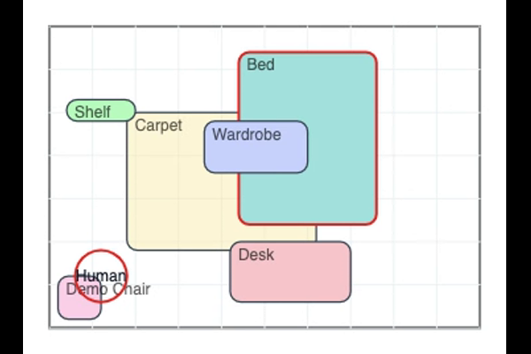

# p5 Room Planner

An interactive 2D room planner built with p5.js. The intention is to explore spatial planning through simple, tangible interactions: placing furniture, snapping to walls and neighbors, understanding vertical relationships (carpets, floor items, hangable shelves), and quickly assessing walkability with a human probe. It’s designed for fast iteration and clear visual feedback.

## Demo

<video src="docs/preview.mp4" autoplay loop muted playsinline width="800">
  Your browser does not support embedded videos. See the GIF below.
</video>

## Features

- Room size: set width/length (cm) and snap epsilon.
- Add items with name, color, and dimensions (W×L×H).
- Drag and snap: align to walls and neighboring edges; carpets act as heightless surfaces.
- Hangable items (e.g., shelves) rest on the highest supporting surface beneath.
- Rotate items 0°/90°; items clamp to remain inside the room.
- Human probe: move a circle to check passability near furniture.
- Undo/redo for changes; import/export the entire scene as JSON.
- Smart zoom: canvas auto-fits the viewport, with scroll fallback for edge cases.

## Use It

- Open `index.html` in a modern browser.
- Adjust Room → Width/Length and Snap epsilon.
- Add Item → set name, size, and color, then click “Add item”.
- Drag items on the canvas; use “Rotate 90°” or press `R`.
- “Snap to nearest wall” places the selected item flush to the closest wall.
- Toggle “Hangable” or “Carpet” to change behavior.
- Move the Human Probe to evaluate space around furniture.
- Export/Import JSON to save and load layouts.
- Shortcuts: Delete, `R`, ⌘/Ctrl+Z (undo), ⌘/Ctrl+Y (redo).

## Gallery

## Tests

An in‑browser test runner is included. It exercises:
- Seeding sample data and verifying items
- Selecting and editing item dimensions, rotation, color, flags
- Adding, duplicating, deleting items
- Undo/redo
- Room resize and zoom
- Basic position clamping logic

How to run:
- Open `tests/runner.html` in a browser (use a local server or open directly). It loads the app and p5.js, then runs tests.
- The top bar shows totals and pass/fail counts. The log panel prints detailed messages and a final scene snapshot for debugging.

Files:
- `tests/runner.html` – harness page (loads the full UI and p5)
- `tests/test-runner.js` – test framework and suite with verbose logging

Notes:
- The runner manipulates the real UI elements (by setting inputs and clicking buttons) so behavior matches the app.
- If a test fails, check the log panel for the exact assertion and values. You can also open DevTools and inspect `scene`.
### Automated build via VS Code task

- Record a short screen capture that shows adding an item, dragging, snapping, and a rotation.
- In VS Code: Tasks → “Build media (GIF + thumbnails)”
  - When prompted, enter the path to your recording (default: `recording.mov`).
  - Outputs into `docs/`: `preview.gif`, `cover-1200x630.png`, `thumb-600x400.png`.
- To tweak:
  - You can set environment variables before running the task if you use a terminal, or run the script directly:
    - `START=00:00:02 DURATION=7 WIDTH=720 FPS=12 bash scripts/make-media.sh recording.mov`
    - `CROP=1200:700:100:80 bash scripts/make-media.sh recording.mov`
